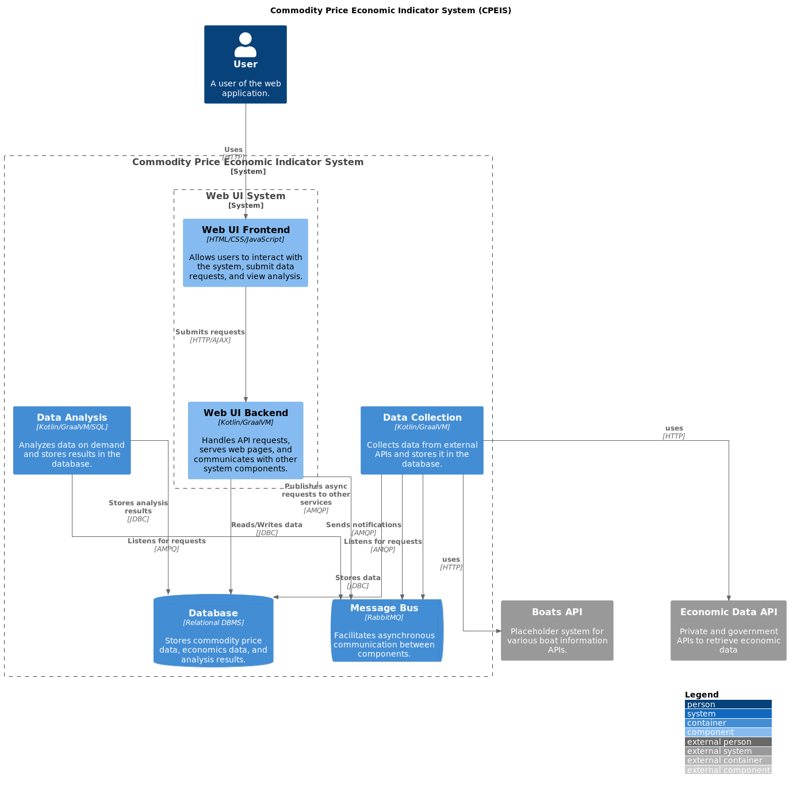

# CSCA 5028 - Final Project Report

A discussion on the system I implemented to meet the A-Level Requirements!

#### Contents

1. [Motivation](#motivation)
    * [Problem](#problem)
2. [Architecture](#architecture)
3. [Sequence Diagram](#sequence-diagram)
4. [Requirements and Refinement](#requirements-and-refinement)
    * [General Requirements](#general-requirements)
5. [Design Decision Highlights](#design-decision-highlights)
    * [Building the App + Web UI](#building-the-app--web-ui)
    * [Handlers](#handlers)
6. [System Requirements and Testability](#system-requirements-and-testability)

---

## Motivation

Motivation for this specific application answers these questions:

1. What problem is the product aimed at solving?
2. Who is the product geared towards (targeted audience)?
3. How is the product unique?

A high-level architecture diagram is also attached, as well as initial requirements, sequence diagram, etc...

### Problem

A population that is under economic pressure will display distress at the margins first.
My hypothesis is that luxury goods (opposite of Giffen goods) will exhibit a decline in demand and price before widespread economic pressures are realized.

This project will track the price of a specific commodity class, along with inflation figures and macroeconomic measures.
We will specifically target the United States, to minimize requirements for understanding worldwide tax regulations, import requirements, etc...

### Target Audience

The immediate users for this project are peer reviewers and faculty in the CU Boulder MSCS program. :-)
Other users might include boat brokers, owners and prospective buyers; a long-term view of pricing trends is valuable to those people.

As our analysis becomes more robust, eventual audience members might include financial analysts, economic researchers, and other marine industry stakeholders. 

### Unique Value

This is a niche focus product, with special value to adjacent industries. It offers a platform for running analyses over a single set of goods with broad implications.
A similar dataset for real estate is used across the financial industry. Our niche is smaller, which brings advantages for this cohort of the population.
It could also offer an early warning functionality for players in the marine market, or for other luxury good market makers.

## Architecture

The architecture of the CPEIS is composed of several components, each with a specific role in the system. The components are as follows:

* Web UI System: This is the user-facing part of the system. It consists of a frontend and a backend. The frontend allows users to interact with the system, submit data requests, and view analysis. The backend handles API requests, serves web pages, and communicates with other system components. 
* Database: This is a SQL-based relational database management system that stores commodity price data, economics data, and analysis results. 
* Data Collection: This component collects data from external APIs and stores it in the database. 
* Data Analysis: This component analyzes data on demand and stores the results in the database. 
* Message Bus: This is a ZeroMQ message bus that facilitates asynchronous communication between components.

Please see the diagram, displayed and linked here.
Note that the `Boats API` is no longer - I'm using the `Econ API` for all the data:

## Sequence Diagram

This is one flow of information through the application.:
Similarly to above, the `Boats API` is no longer:

## Requirements and Refinement

I'll discuss changes from the above discussion first:

1. I changed from boat pricing to general commodity pricing based on FRED. That's because boat pricing was nearly impossible to get! The APIs I planned to use were closed for registration.
2. Instead of daily inflation, I used an [index proxy](https://fred.stlouisfed.org/series/T5YIE) from FRED. The CPI index isn't calculated or published daily.

### General Requirements

The architecture and non-functional requirements are largely dictated by the course (CSCA 5028) for which this software is built.

Please see [Grading Criteria](./2-GRADING-CRITERIA.md) for a checklist on architecture and implementation.

There are functional requirements for the specific application:

1. The system must allow the user to select a date range and commodity group to compare.
2. The system should conduct on-demand data collection.
3. The system should conduct analysis on demand, if data is available, or immediately after collection.
4. The system must push information to the user interface.

## Design Decision Highlights

I made the decision to use a relational database over a NoSQL database because of the structured nature of the data being collected and analyzed.
Relational databases are well-suited for handling structured data and provide robust querying capabilities, which are essential for the data analysis component of my system.

The choice of Kotlin for the backend and data collection/analysis components was based on the performance and interoperability benefits of these technologies.
Kotlin was provided in the "model project", and it's a statically typed language that offers excellent performance.
An added benefit was Ktor, which made metrics and HTTP routing a snap.

A message bus was required for the application, but why ZeroMQ?
It's because of the requirement to deploy this thing quickly and easily for demonstration purposes.
Deployment uses Cloud Run, which is perfect for single-container systems.
Rather than run many services in a single container, it made sense to use a fast-to-build, fast-to-deploy, reliable bus that stays local.
I was able to avoid more complex networking considerations in this model.

### Building the App + Web UI

I like Gradle for builds, because it makes tasks easy to add.

You can see in my [`build.gradle`](../applications/single-process-app/build.gradle) that I'm also building the web UI, which I serve via my the main HTTP server.
For low traffic apps, this is much simpler than setting up a CDN, etc...

### Handlers

One implementation design choice worth calling out is the separation of handlers from the routing setup.
You can see them [HERE](../applications/single-process-app/src/main/kotlin/edu/colorado/HttpHandlers.kt).

In general, separating the handlers from routing setup allows improved testability.
You can also inject dependencies to your handlers directly, or use closures to embed them (ex: a logger).

## System Requirements and Testability

By design (and by requirements), components are decoupled.
That made integration testing much simpler than in a tangled monolith.

From a software implementation perspective, I tried to keep most functions small and pure. 
Writing unit tests is much simpler WITHOUT having mocks and doubles - I consider that a sign of refactor-ready code.

The highly structured data from FRED also helped with testability - simple JSON blobs could be used as fixtures.
