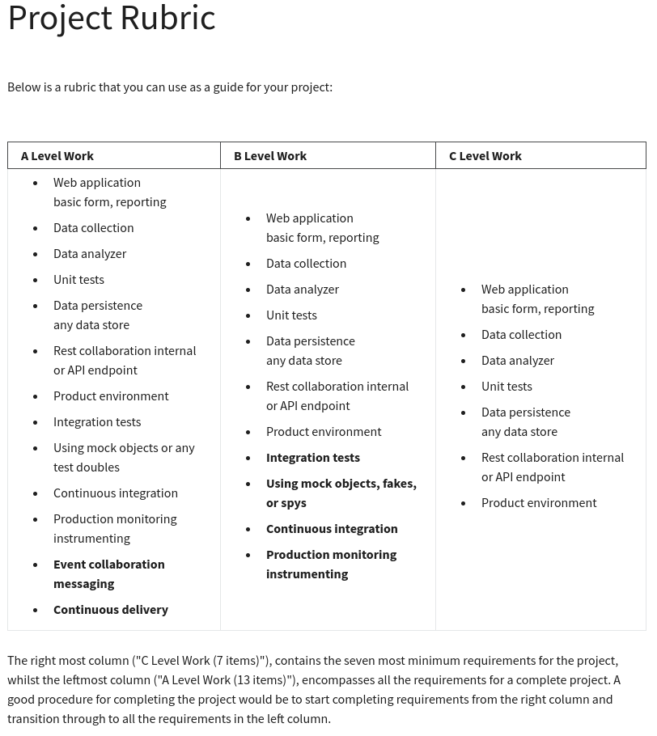

# Grading Criteria

This is a project for the CU Boulder MS Computer Science.

Here is the rubric used for grading - and thus the minimum viable product/requirements.

## A-Level Work

Order and nesting updated from curriculum for task planning.

* Web application basic form, reporting
    * Rest collaboration internal or API endpoint
* Data collection
    * Data persistence, any data store
* Data analyzer
* Event collaboration messaging
* Unit tests
* Integration tests
    * Using mock objects or any test doubles
* Product environment 
* Production monitoring instrumenting 
* Continuous integration
* Continuous delivery
