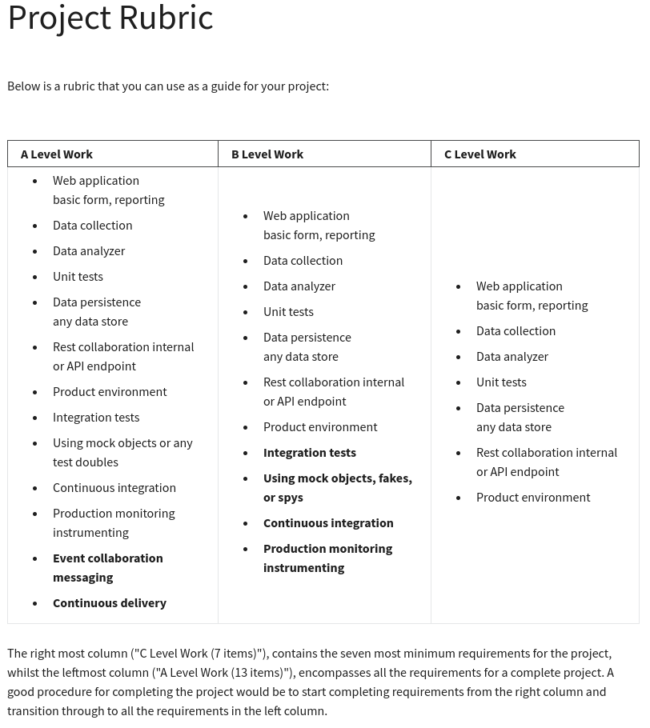

# Grading Criteria

This is a project for the CU Boulder MS Computer Science.

Here is the rubric used for grading - and thus the minimum viable product/requirements.

## A-Level Work

Order and nesting updated from curriculum for task planning.

* [x] (React) Web application basic form, reporting
    * [x] (Ktor Application + Routing) Rest collaboration internal or API endpoint
* [x] (Kotlin process w/ message bus listener + H2) Data collection
    * [x] (H2 file-based SQL db) Data persistence, any data store
* [x] (Kotlin process w/ message bus listener + H2) Data analyzer
* [x] (TCP-based ZeroMQ broker using ZMTP) Event collaboration messaging
* [x] (`JUnit`+ and `vitest`) Unit tests
* [x] (`JUnit`+) Integration tests
    * [x] Using mock objects or any test doubles
* [x] (Provided using env vars to Cloud Run) Product environment 
* [x] (Prometheus-compatible `/metrics` endpoint) Production monitoring instrumenting 
* [x] (GitHub Actions `.github/workflows/build-and-push.yml`) Continuous integration
* [x] (GitHub Actions `.github/workflows/deploy.yml`) Continuous delivery
